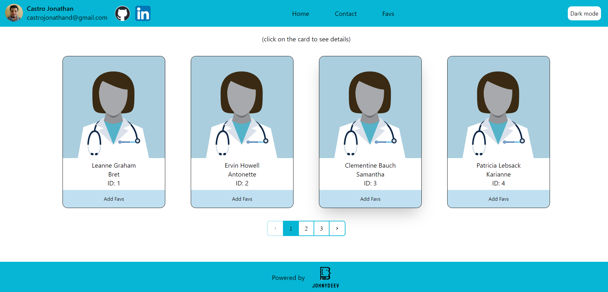

# [Card Dentist](https://aws-reactjs-castro-jonathan.s3.amazonaws.com/index.html)

Proyecto que consume una API la cual devuelve informacion de 10 dentistas que son renderizados en cartas de presentacion para una mejor visualizacion `bashh`.

.

## Funcionalidades actuales y futuras

- [x] Responsive
- [x] Dark mode
- [x] Paginación
- [x] Favoritos
- [x] Deploy en AWS S3
- [x] Local Storage para favoritos
- [ ] Mensajeria con **Nodemailer**
- [ ] Authentication

## API utilizada: https://jsonplaceholder.typicode.com/users 

## Tech Stack

- **Frontend:** [Vite](https://vitejs.dev/)
- **Back/API:** [jsonplaceholder](https://jsonplaceholder.typicode.com/users)
- **Styling:** [Tailwind CSS](https://tailwindcss.com)

